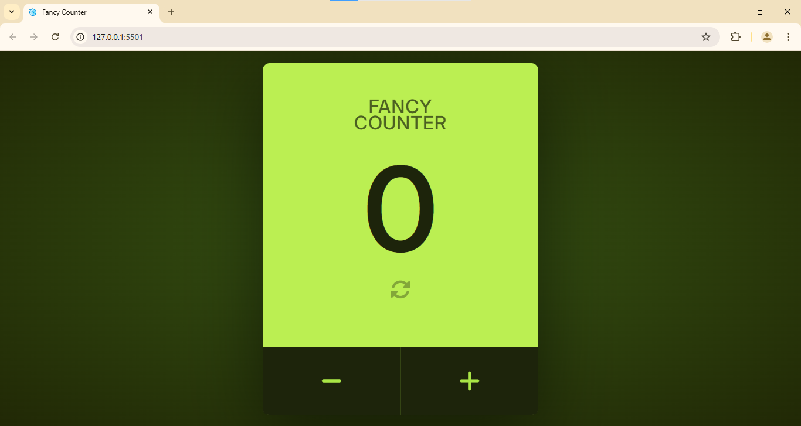

# Fancy Counter

A visually appealing and interactive counter application built with HTML, CSS, and JavaScript. This project demonstrates a simple yet elegant counter with customizable features and responsive design.

## Features

- **Increase and Decrease Counter**: Increment or decrement the counter value.
- **Reset Counter**: Reset the counter to its default value.
- **Counter Limit**: Set a maximum limit for the counter and display a message when the limit is reached.
- **Responsive Design**: Adjusts seamlessly to different screen sizes.
- **Customizable Styling**: Attractive user interface with modern gradients and hover effects.

## Technologies Used

- **HTML5**: For structuring the web application.
- **CSS3**: For styling and responsiveness, including gradients, shadows, and media queries.
- **JavaScript (ES6)**: For dynamic functionality, including event listeners and DOM manipulation.
- **Google Fonts**: For modern typography.
- **Font Awesome**: For elegant icons.

## Demo

Check out the live demo of the Fancy Counter on [GitHub Pages](https://neendudev.github.io/Fancy-Counter/).

## Usage

- Click the **+** button to increase the counter value.
- Click the **-** button to decrease the counter value (value cannot go below 0).
- Click the **reset** button to reset the counter to 0.
- A message will appear when the counter reaches its limit, encouraging users to "buy pro" for extended usage.

## Customization

- **Counter Limit**: Change the counter limit by modifying the `COUNTER_LIMIT` constant in `script.js`.
- **Styling**: Update the styles in `style.css` to match your preferences.
- **Title**: Modify the default title by updating the `updateTitle` function in `script.js`.

## File Structure

- `index.html`: Contains the structure of the application.
- `style.css`: Contains styles for the application, including responsiveness.
- `script.js`: Contains the logic for counter functionality.

## Contributing

Contributions are welcome! Feel free to open an issue or submit a pull request.

1. Fork the repository.
2. Create your feature branch: `git checkout -b feature-name`.
3. Commit your changes: `git commit -m 'Add some feature'`.
4. Push to the branch: `git push origin feature-name`.
5. Open a pull request.

## License

This project is licensed under the MIT License. See the [`LICENSE`](./favicon.svg) file for details.

## Acknowledgments

- [Font Awesome](https://fontawesome.com/) for the icons.
- [Google Fonts](https://fonts.google.com/) for the typography.
